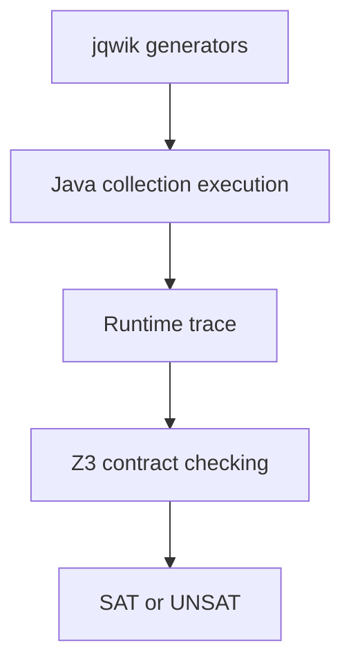

# Java Collection Contract Verifier

[](https://github.com/hakanmtn/MeineBachelorarbeit/actions/workflows/ci.yml)

This repository contains the implementation developed for my bachelor thesis at
Ludwig Maximilian University of Munich (LMU): **Conformance Checking Between
Java Classes and Formal Models** (*Konformitätsprüfung zwischen Java-Klassen
und formalen Modellen*).

The project checks whether observed executions of Java collections conform to
formal operation contracts. It combines property-based test generation with
runtime tracing and bounded trace checking in the Z3 SMT solver.

## Highlights

- Java 22 implementation with interfaces, records, generics, and immutable
  operation objects
- Property-based generation of realistic operation sequences with jqwik
- Complete runtime traces containing pre-state, operation, result, and
  post-state
- Java-to-SMT translation through the Z3 Java API
- Support for `ArrayList`, `LinkedList`, `HashSet`, and `TreeSet`
- List and set contracts for `add`, `remove`, `contains`, `clear`, and
  `isEmpty`, plus indexed list operations
- Mutation tests for contract, encoder, and trace errors
- UNSAT core labels for diagnosing contradictions

## Verification workflow



Each operation implements both its concrete Java execution and the formal
contracts used for list and set semantics. `CollectionOperationExecutor`
records the execution history. `CollectionZ3Verifier` binds the observed Java
states to SMT sequences and checks all instantiated contracts.

## Technology

- Java 22
- Maven
- Z3 4.12.2 Java API
- jqwik 1.9.2
- JUnit 5

The Maven build uses `z3-turnkey`, which provides the Z3 Java API and matching
native libraries. A separate local Z3 installation is not required.

## Run the tests

Prerequisites:

- JDK 22
- Maven 3.9 or newer

```bash
mvn test
```

Set `Config.VERBOSE` to `true` to print concrete Java states, SMT sequence
representations, instantiated contracts, solver results, and UNSAT core labels.

## Evaluation summary

The thesis evaluation covered `ArrayList`, `HashSet`, and `TreeSet`. Across 30
generated sequences with 134 operations, all unmodified traces were classified
as SAT. Mutations of contracts, state encoding, and recorded results produced
UNSAT with short counterexamples. Verification of the evaluated trace lengths
completed in the millisecond range.

## Scope and limitations

The implementation performs bounded checks over generated traces and finite
integer domains; it is not a proof for arbitrary execution lengths. Java
collections are treated as reference implementations. Iterator operations,
bulk operations such as `retainAll`, and exceptional precondition violations
are outside the evaluated scope.

## Project structure

```text
src/main/java/model/             execution and verification core
src/main/java/model/operations/  executable operations and Z3 contracts
src/main/java/util/              Z3 bootstrap helper
src/test/java/model/             property-based and mutation tests
```
